# fluide User Guide

### Document Control

| **Author Name** | **Emma Sciberras** |
| :--- | :--- |
| **Title** | **fluide User Guide** |
| **Author Contact** | **emma-lee.sciberras@mclarenint.com** |
| **Document Name** | **fluide User Guide V2.0** |

#### Version History

| **Version** | **Effective Date** | **Update Originator/Author** | **Reason Comment** |
| :--- | :--- | :--- | :--- |
| **1.0** | **24/11/2016** | **Marc Jonkers** | **Initial Release** |
| 2.0 **** | **6/07/2018** | **Emma Sciberras** | **Updated release** |

### fluide Admin Login

The login page for fluide is always 

&lt;property&gt;.fluide.mclarenint.com/HSM/HSM.php or &lt;IP address&gt;/HSM/HSM.php

This page will give you a login prompt.

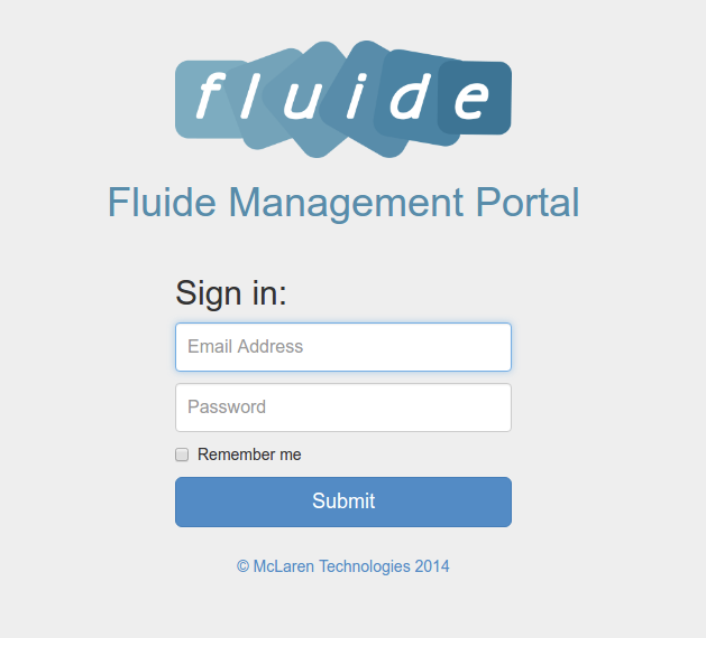

All accounts will consist of an email address and a password. An account can only be created from an existing administrator account within fluide.   

### Access Levels

fluide has three levels of access. The default privileges for each access level are described below. These defaults can be adjusted by McLaren staff to suit each fluide instance. The purpose and usage of the various modules will be explained elsewhere in this document.

#### Staff

This is the base level of access. Staff level users can only create hotspot tickets \(if the hotspot module is in use\) and use the Guest Management Tool to see details about a guest account. They will also have access to Live Devices reports.

#### Supervisor

On top of what's included in staff access, Supervisors will also have the following modules available:

* Add/edit/delete access plans for any of the modules that are enabled for the site \(inroom, hotspot, self-service, conference\)
* Live Transactions report

#### Administrator 

Administrators are given access to all areas of fluide.

* Add/edit/delete user accounts
* Set Report Recipients
* fluide Analytics

### **Landing Page & Main Menu**

If the account has administrator rights, the landing page shown is the fluide Dashboard. 

If the account does not have administrator rights, the first page will be the Guest Management Tool \(GMT\) page. 

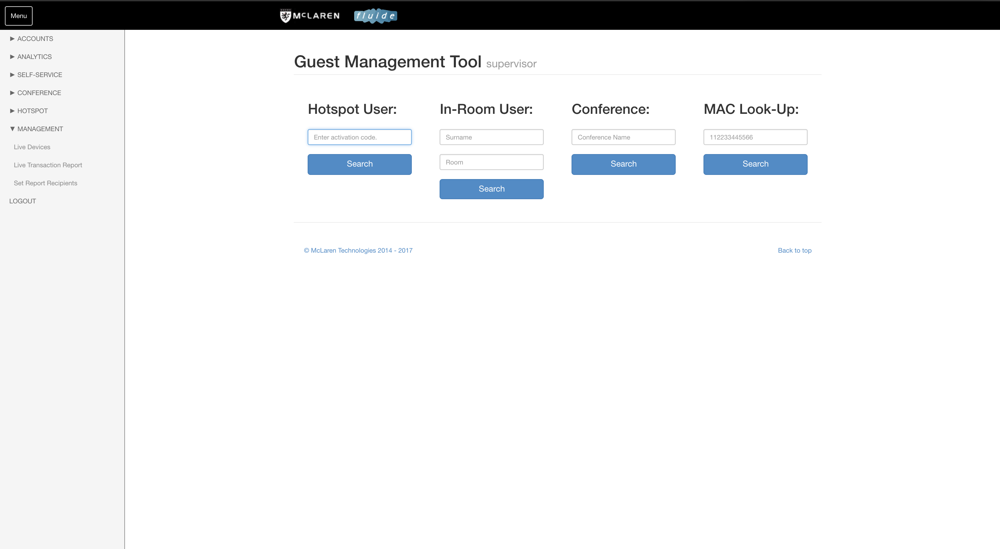

The access level will be indicated next to the page name if the user is not of the basic ‘Staff’ level.

The main menu is situated on the left hand side of the screen and is persistent throughout and dynamic. It will only display the items that are available to the access level of the user.

### The fluide Dashboard

The fluide Dashboard, different to the Server Dashboard, provides an overview of active plans, conferences and devices, used bandwidth, users and Facebook statistics. Charts are able to be changed to hourly, daily, weekly, monthly or yearly. The fluide Dashboard can be found under the analytics tab, and on the home page of an admin account. 

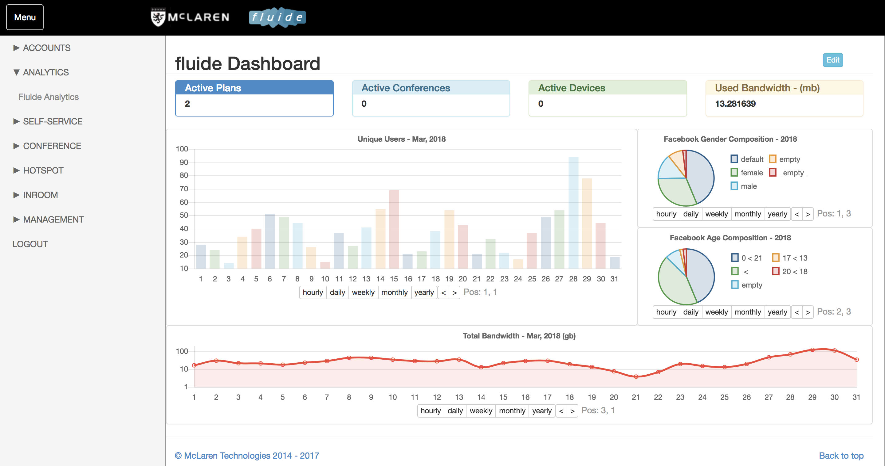

### Accounts

#### Add Account

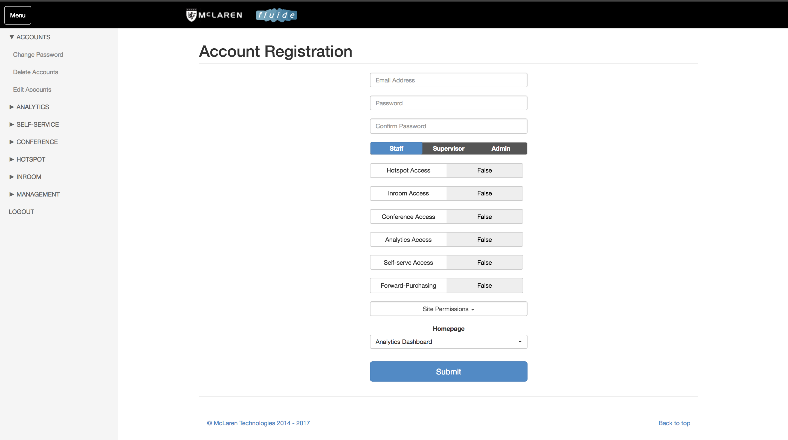

Accounts are created to allow access to the fluide portal. You'll be required to enter an email address and a password during account creation. The password can be changed by the user once they have logged into fluide. 

The permission level \(Staff/Supervisor/Admin\) of the account will be selected during account creation. 

To determine which site the account has permission to access, the admin may select the list of sites available in site permissions. 

To change the landing page of an account, the admin may click the drop down menu under Homepage and select accordingly.

When creating an admin account \(to be done by admin only\), email address and passwords are part of the login credentials required. Admin accounts will be given access to all modules and sites available, while homepage will default to display the fluide dashboard, this cannot be changed. 

#### Change Password

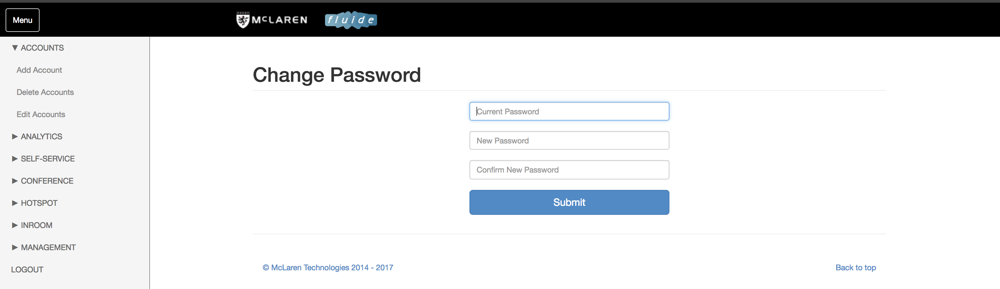

Users may change their passwords after logging in by going to Accounts &gt; Change Password. They will be required to input their existing password and new password. Once they hit the Submit button, the new password will be saved and they can utilize it to log in during their next log in attempt. 

#### Delete an account

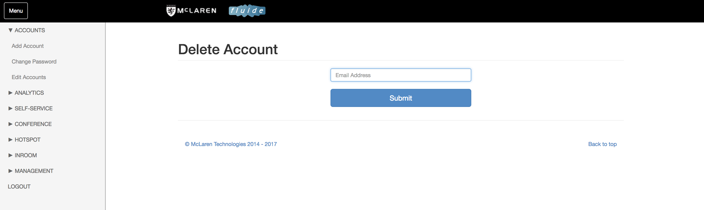

Admins are given access to delete an account in the fluide portal. When deleting accounts, admins will enter the email of the account to be deleted &gt; hit Submit button and a confirmation screen will be displayed.

If the confirmation screen is not displayed, please check that the email address entered is correct and try again, Please ensure the email address entered is the same as the one the user uses to log in to fluide. 

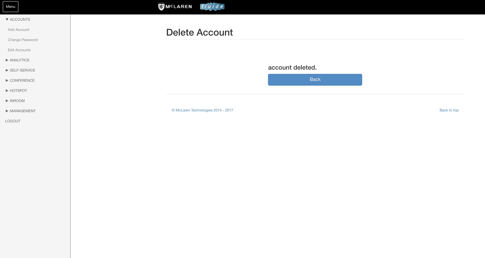

#### Editing an account

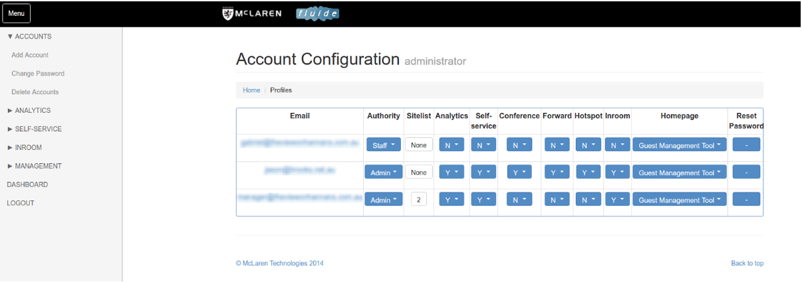

Admins are given the rights to modify the paracmeters associated to existing user accounts of all access levels. This includes changing the accounts access to a specific module, configuring the landing page, as well as resetting a users password when required. 

### fluide Analytics

fluide analytics consists of a number of detailed historical and up to date charts that cover all elements of guest behaviour and Internet utilisation.

The chart types are:

* Average Usage
* Average Duration
* Average Users / Time
* OS Chart
* Total Usage
* Unique Users

All charts are monthly charts with one column per day except for the Average Users / Time chart, which is a daily chart with a granularity which can be set \(see image below\). The OS Chart is monthly, however it is a pie chart.

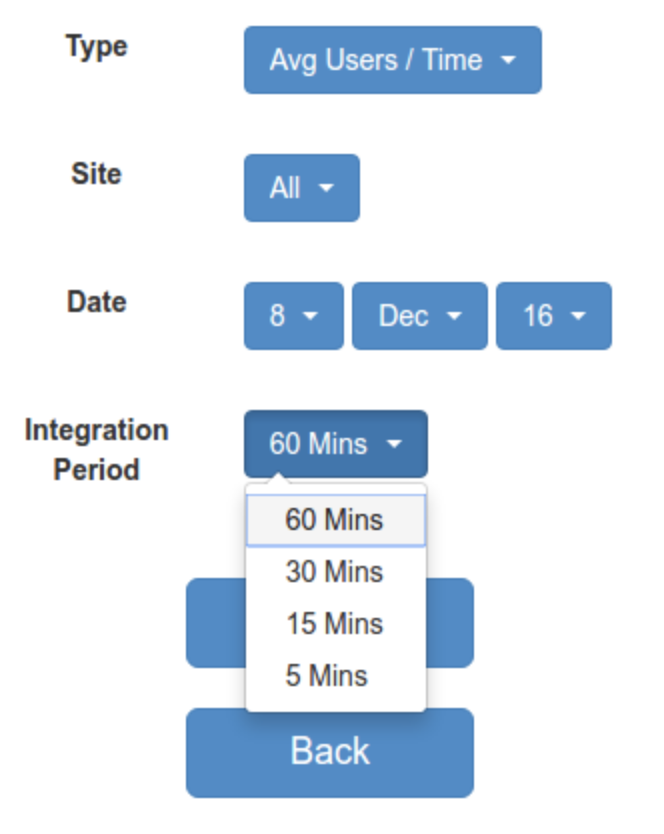

All charts can be emailed once generated, and a CSV file with the chart data can be attached. 

### **Self-service / Inroom / Hotspot**

* Self-service plans are applied automatically to guests logging in to a specific location.
* Inroom plans require a last name and room number to log in and are checked against the property’s PMS.
* Hotspot plans are used to create an access code at the property front desk which is given or emailed to a guest.

The plans mentioned above applies to different guest type, however, the creation and configuration of plans are similar. 

#### Add plan

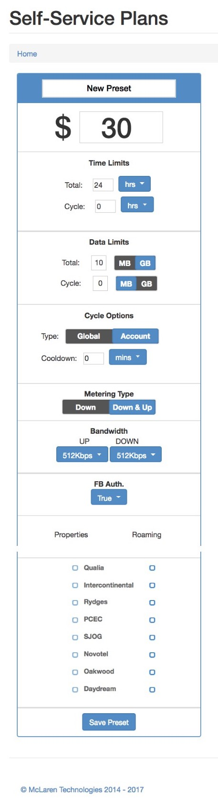

This panel collects all the parameters that need to be defined for a new plan.

|  |  |
| :--- | :--- |
| **Name** | **The name visible to guests.** |
| **Amount** | **For a free plan, enter 0, otherwise enter the dollar amount** |
| **Device Limit** | **The maximum number of devices that can be associated with this plan.** |
| **Time Limit** | **How long the plan will remain active for. Enter 0 for unlimited.** |
| **Cycle** | **How much data over a set amount of time the user has available. Enter 0 for unlimited** |
| **Data Limit** | **The plan will expire after the data limit is reached. Enter 0 for unlimited.** |
| **Metering Type** | **Count all data, or only the download.** |
| **Bandwidth** | **Upstream and downstream speed.** |
| **Loyalty** | **If VIP tags are active in the PMS these can be linked to a plan.** |
| **Properties** | **Locations the plan will be present at.** |
| **Roaming** | **Locations the plan can be used.** |

#### Time and data limits

Time and data limits are used to restrict guest usage. There are two levels of restriction, Total and Cycle. 

**Total** time and data limits pertain to the absolute maximum for the plan. For example a total limit of 1GB and 5 days means that the plan will get capped when either one of those limits is reached. There is no restriction of how the data gets consumed. If the guest consumes the data in the first hour, they will get capped and not be able to use their plan for the rest of the time.

**Cycle** limits can be used to further restrict the guest by setting data limits for specific time periods. For example the total could be 5GB and 5 days, with a cycle of 2GB per day. This means no more than 2GB could be used in any one day of the total 5 day plan. Once the cycle limit gets reached, the plan would be disabled for the rest of the cycle period \(in this case for the rest of the day\).

#### Edit plans

On this screen all parameters as described in the Add Plan section above can be edited for any existing plans. Users may also delete an existing plan. TOn this screen, the plans displayed can be edited and deleted. If you are unable to identify a desired plan, please ensure you are looking into the correct module - whether it is self-service, hotspot or inroom.   

### Management

#### Guest Management Tool

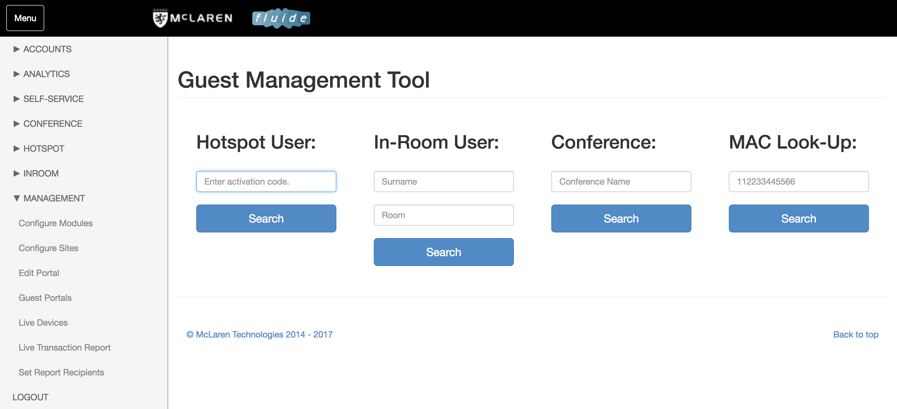

This is the default screen for most users. It enables a guest lookup either via the guest device MAC address, or via their last name and room number \(for inhouse guests\).

The GMT will show a great amount of detail about a guest account.

The top section shows the plan parameters and how much time and data has been used in total.

The middle section shows detailed information for each of the devices that are using the plan, including device type, number of sessions, data usage and time spent online.

The bottom section is a graphical representation of the movements of each device between the various locations it is allowed to roam to.

This tool typically answers any questions the quest may have pertaining to their internet usage or account. The tool will tell you if a guest has exceeded their accounts time or data limit, the number of devices connected, the devices being used and at which locations.   

#### Live Devices

The live devices log provides an easy to read overview of all devices that are currently using the Internet. The account ID can be clicked on to open the GMT for that account and see the detail. The current user is also able to sort using the arrows next to every type of information. 

#### Live Transaction Record

The live transactions log provides an easy to read overview of all plan purchases that have occurred on the current day. The account ID can be clicked on to open the GMT for that account and see the detail.

#### Set Report Recipients

This is where the email distribution lists are set up for the daily reports. fluide can send daily reports for all transactions, Top20 users and all active devices. These reports are generated per location, and are divided by account type \(free / paid, inroom / hotspot, etc\).

